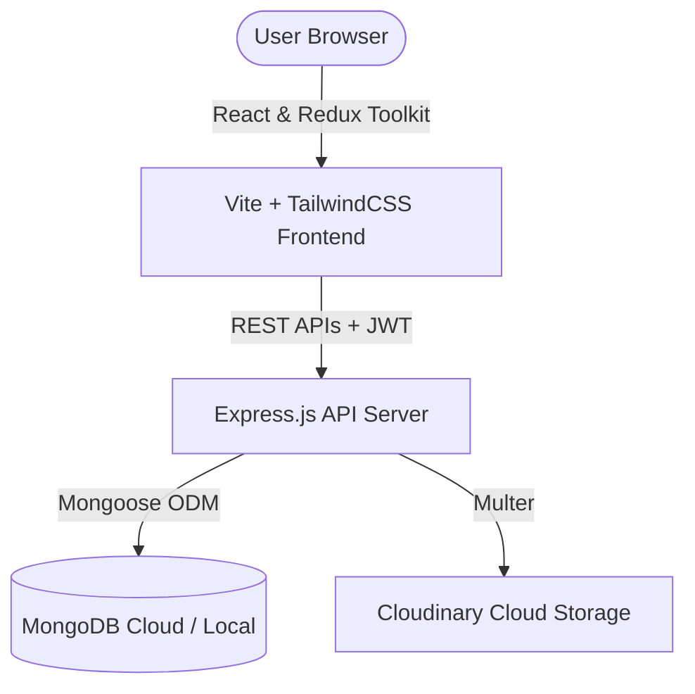

# BuildLedger 🏗️ – House Construction & Cost Tracker

A modern, full-stack construction project management web application. **BuildLedger** helps real estate developers, contractors, and individual homebuilders track their budgets, analyze material purchases, manage contractor schedules & payments, upload invoices, and visualize expense analytics in real-time.

---

## 🌟 Core Features

- **📊 Centralized Dashboard:** Real-time summary of total budget, money spent, budget alerts, recent activities, and project status indicators.
- **🏗️ Multiple Project Tracking:** Manage multiple construction sites, update budgets dynamically with full budget adjustment audit logs.
- **🧱 Material Purchase Ledger:** Record purchases (cement, steel, sand, plumbing, electrical, etc.), track delivery statuses, and monitor unit costs.
- **👷 Contractor Management:** Maintain contractor profiles, record work orders, track task completion progress, and log payment history.
- **🧾 Bill & Invoice Organizer:** Upload and organize bills/invoices directly to the cloud (integrated with Cloudinary) with instant status flags.
- **📈 Advanced Analytics:** Graphical reports showcasing category-wise expense distribution, budget utilization charts, and contractor cost trends.
- **🔒 Dynamic Theme & Security:** Premium glassmorphism UI with support for dark/light mode, fully responsive layouts, and robust JWT-based user authentication.

---

## ⚙️ Architecture & Tech Stack



### Frontend
- **Framework:** React 19 (via Vite)
- **Styling:** TailwindCSS v4 (Glassmorphic, custom dark/light theme, modern typography)
- **State Management:** Redux Toolkit
- **Routing:** React Router v7
- **Data Visualization:** Recharts
- **Icons:** Lucide React
- **Notifications:** React Hot Toast

### Backend
- **Platform:** Node.js & Express.js
- **Database:** MongoDB with Mongoose ODM
- **Authentication:** JSON Web Tokens (JWT) & bcryptjs hashing
- **File Upload:** Multer & Cloudinary SDK
- **Environment Management:** Dotenv
- **API Validation:** Express Validator

---

## 📂 Project Directory Structure

```text
house-construction-tracker/
├── backend/
│   ├── index.js                     # Backend Express App entrypoint
│   ├── src/
│   │   ├── config/                  # Third-party configurations (Cloudinary, etc.)
│   │   ├── controllers/             # Request handlers (Auth, Projects, Materials, etc.)
│   │   ├── middleware/              # Route protection and JWT verification
│   │   ├── models/                  # Mongoose MongoDB Schemas
│   │   ├── routes/                  # Express REST routes
│   │   └── utils/                   # Shared utility helpers (Activity Logger)
│   └── package.json
│
├── frontend/
│   ├── vite.config.js               # Vite build config
│   ├── index.html                   # Entry HTML page
│   ├── src/
│   │   ├── App.jsx                  # Main wrapper with Providers (Redux, Router)
│   │   ├── components/              # Shared dashboard cards, modals, lists, headers
│   │   ├── context/                 # Context Providers (Theme, Auth)
│   │   ├── pages/                   # Application Pages (Dashboard, Project Detail, etc.)
│   │   ├── redux/                   # Redux Slices & Store configuration
│   │   ├── routes/                  # Client-side routing configuration
│   │   └── services/                # API client integration (Axios instance & wrappers)
│   └── package.json
└── README.md                        # Project documentation (this file)
```

---

## 🚀 Setup & Installation Instructions

Follow these steps to run both the frontend and backend servers locally on your machine.

### Prerequisites
- [Node.js](https://nodejs.org/) installed (v18+ recommended)
- [MongoDB](https://www.mongodb.com/try/download/community) server running locally or a MongoDB Atlas cloud URI
- [Cloudinary](https://cloudinary.com/) account credentials (for invoice upload support)

---

### Step 1: Clone the Repository
```bash
git clone https://github.com/sarthak-shastrakar/house-tracker.git
cd house-construction-tracker
```

---

### Step 2: Configure & Run Backend

1. **Navigate to the Backend Directory:**
   ```bash
   cd backend
   ```
2. **Install Backend Dependencies:**
   ```bash
   npm install
   ```
3. **Set Up Environment Variables:**
   Create a `.env` file inside the `backend/` directory:
   ```env
   PORT=5000
   DB_LINK=your_mongodb_connection_uri
   JWT_SECRET=your_jwt_secret_key_here
   CLIENT_URL=http://localhost:5173
   
   # Cloudinary configuration
   CLOUDINARY_CLOUD_NAME=your_cloudinary_cloud_name
   CLOUDINARY_API_KEY=your_cloudinary_api_key
   CLOUDINARY_API_SECRET=your_cloudinary_api_secret
   ```
4. **Start the Backend Server (Development Mode):**
   ```bash
   npm run dev
   ```
   The backend API will run on `http://localhost:5000`.

---

### Step 3: Configure & Run Frontend

1. **Open a new terminal and navigate to the Frontend Directory:**
   ```bash
   cd frontend
   ```
2. **Install Frontend Dependencies:**
   ```bash
   npm install
   ```
3. **Start the Frontend Development Server:**
   ```bash
   npm run dev
   ```
   The application will be accessible at `http://localhost:5173`.

---

## 📡 API Reference endpoints

Here is a summary of the backend REST endpoints:

| Endpoint | Method | Authentication | Description |
| :--- | :--- | :---: | :--- |
| `/api/auth/register` | POST | Public | Register a new user |
| `/api/auth/login` | POST | Public | Log in user and receive JWT token |
| `/api/dashboard` | GET | Protected | Retrieve consolidated metrics for active projects |
| `/api/projects` | GET / POST | Protected | Get all projects / Create a project |
| `/api/projects/:id` | GET / PUT / DELETE | Protected | Manage a single project |
| `/api/materials` | GET / POST | Protected | Get all material purchases / Record purchase |
| `/api/contractors` | GET / POST | Protected | Get contractor list / Add contractor |
| `/api/bills` | GET / POST | Protected | Get invoices / Upload invoice with image attachment |
| `/api/analytics` | GET | Protected | Generate charts data (spend distribution, timeline) |

---

## 🎨 Design Philosophy & UX Highlights

- **Dynamic Theme Context:** Instantly toggles between light and dark modes across the app.
- **Progress Tracking Warnings:** Highlights budget thresholds visually in red/yellow if a project reaches `> 80%` of its allocated budget.
- **Fully Responsive Navigation:** Floating sidebar that adapts smoothly to mobile screens.
- **Glassmorphism Design:** Styled with CSS backdrop filters and refined color palettes for a highly polished appearance.
